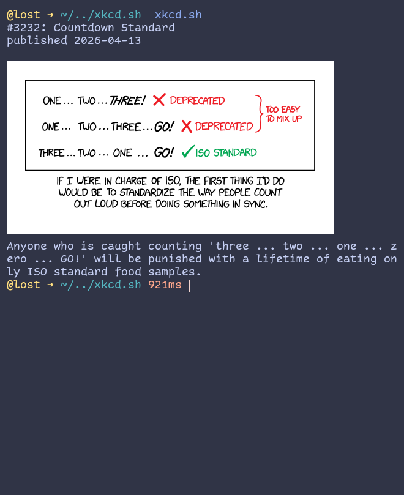

# xkcd.sh

> xkcd reader in bash shell script using icat and curl

xkcd.sh is a very simple xkcd reader that uses `icat` and `curl` to get an xkcd comic and show it in the terminal. It uses `icat` to show the images and `curl` to get the comic.

## Usage

- Just run the command with the comic number: `xkcd.sh 730`
- Or if you want the most recent comic, run: `xkcd.sh`
- `-t` prints the transcript along with the image, but not very well. I don't recommend it.
